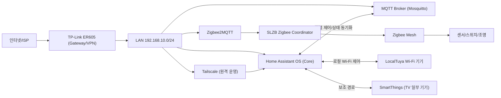
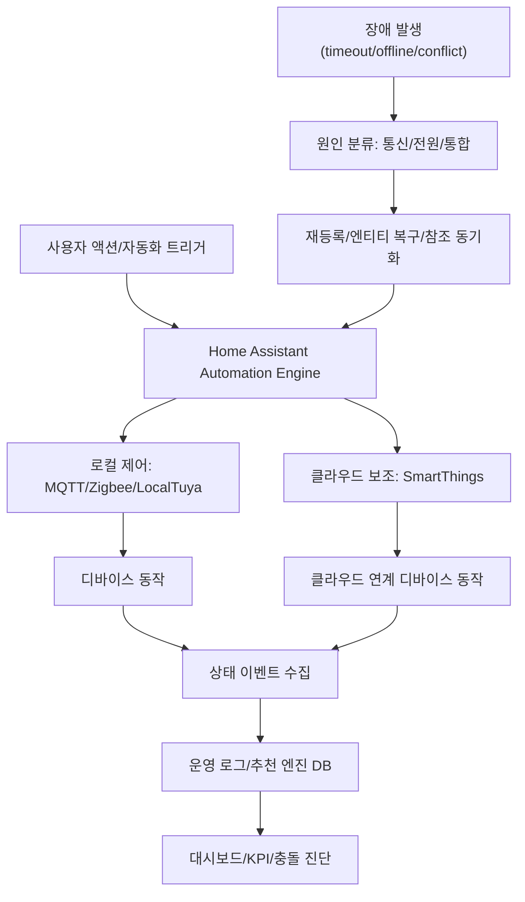
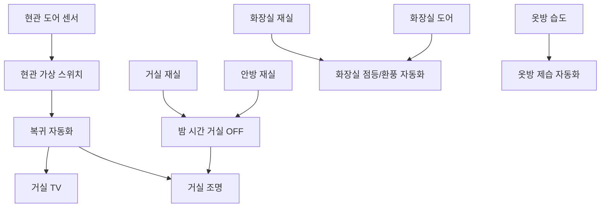

# IoT Network Engineer Portfolio
## HAOS_Control: 로컬 우선 스마트홈 네트워크 통합/운영

> 프로젝트: HAOS_Control  
> 작성일: 2026-03-19 (Asia/Seoul)  
> 지원 직무: IoT 네트워크 엔지니어

---

## 1) 시작 배경
기존 환경은 SmartThings, Tuya, iOS 단축어가 혼합되어 장애 발생 시 원인 추적이 어렵고, 외부망 장애 시 제어 공백이 발생했습니다.  
이를 해결하기 위해 Home Assistant를 중심 허브로 재설계하고, 로컬 제어(MQTT/Zigbee/LocalTuya) 중심 구조로 전환했습니다.

---

## 2) 네트워크 및 기기 구성

### 2-1. 인프라 구조
- 외부 인입: SKB 모뎀
- 게이트웨이: TP-Link ER605 (VPN 라우터)
- 내부망: `192.168.10.0/24`
- 무선 확장: Wi-Fi 공유기 브리지 모드
- 외부 접근: Tailscale VPN

운영 원칙:
- DHCP 예약 기반 고정 IP 운영
- 기기 식별(IP/MAC/IEEE) 일관성 유지
- 로컬 제어 우선, 클라우드 경로는 보조로 사용

### 2-2. 디바이스 현황
- Wi-Fi: 15대 (LocalTuya 주경로, SmartThings 보조)
- Zigbee: 17대 (Coordinator → Zigbee2MQTT → MQTT)

---

## 3) 시각화 다이어그램

### 3-1. L1 토폴로지(면접 본문용)

### 3-2. 제어/관측 데이터 흐름

### 3-3. 자동화 연계도(직관형)

---

## 4) 기술 선택 및 문제 대응

### 4-1. 통신 장애 대응
- Wi-Fi 조명 연결 끊김: LocalTuya 로컬 경로 전환
- Zigbee 지연/오프라인: 채널 최적화 + 재조인 절차 적용

### 4-2. 운영 장애 대응
- 배터리 기기 Deep Sleep 이슈: 이벤트 기반 구조로 전환
- 재등록 후 자동화 미동작: 엔티티 ID/디바이스명/참조 일괄 동기화
- 중복 명령으로 지연: 상태 확인 조건 추가(이미 동일 상태면 전송 생략)

---

## 5) 자동화 운영 예시(직관형)

| 상황(입력) | 자동 동작(출력) | 안전 조건/예외 | 체감 효과 |
|---|---|---|---|
| 거실 재실 해제 + 밤 시간 | 거실 조명 OFF | 타 방 재실 시 실행 안 함 | 취침 시간 조명 자동 정리 |
| 안방 침대 재실 감지 | 취침 준비 + 보조 기기 ON | 침대 재실 스위치 ON 상태에서만 동작 | 수면 루틴 자동화 |
| 화장실 재실/도어 변화 | 조명/환풍기 제어 | 이미 같은 상태면 명령 생략 | 체류 패턴 기반 자동 제어 |
| 옷방 습도 임계치 도달 | 제습기 ON/OFF | 사용자 제어 기준은 humidifier 단일 엔티티 | 습도 안정화 |

---

## 6) 운영 성과
기준 시점(2026-03-19):
- 이벤트 로그: **6,057건**
- 액션 분포: **자동화 1,423 / 수동 216 / 시스템 4,418**
- 실행 결과: **success 6,054 / cancelled 3 / failed 0**
- 추천 후보: **50건** (`proposed 45 / rejected 3 / rolled_back 2`)

핵심 성과:
- 자동화 중심 운영으로 수동 제어 감소
- 장애 대응 절차 표준화로 복구 일관성 확보
- 로그 기반 개선 루프로 운영 품질 지속 향상

---

## 7) 담당 역할
- 네트워크 토폴로지/주소 정책 설계
- Zigbee/Wi-Fi 혼합망 안정화 운영
- 엔티티 표준화 및 자동화 참조 정합성 복구
- 장애 대응 SOP 수립(분류/복구/검증)
- 추천 엔진/운영 대시보드 개선

---

## 8) 제출용 요약
이 프로젝트는 단순 자동화 구현이 아니라,  
**혼합 IoT 네트워크를 운영 가능한 구조로 표준화하고 장애를 재현 가능하게 복구하는 실무 역량**을 보여주는 사례입니다.
