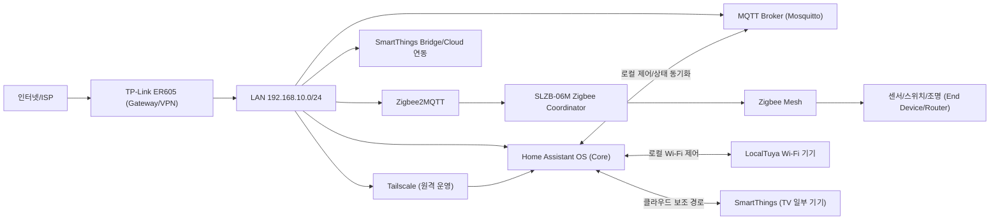
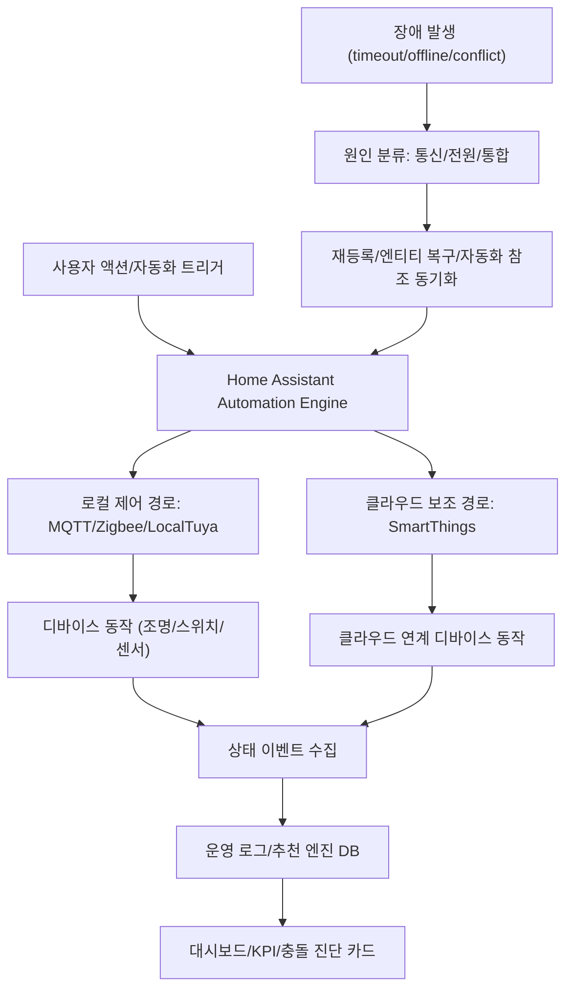

# IoT 네트워크 엔지니어 지원용 통합 포트폴리오 v1

> 프로젝트: HAOS_Control  
> 작성일: 2026-03-19 (Asia/Seoul)  
> 목적: 이 문서 1개로 네트워크 설계/운영/장애대응/보안/자동화 역량을 전달

---

## 1) Executive Summary

HAOS_Control은 Home Assistant OS 중심의 로컬 우선 스마트홈 운영 플랫폼이다.  
핵심 가치는 다음 3가지다.

1. 클라우드 의존도를 줄이고 로컬 제어/관측 일관성을 확보
2. Zigbee/Wi-Fi/MQTT/SmartThings 혼합 환경의 네트워크 안정성 운영
3. 운영 로그 기반 추천 엔진으로 자동화를 지속 개선

실운영 스냅샷(2026-03-19):
- 이벤트 로그: **6,057건**
- 자동화/수동/시스템 액션: **1,423 / 216 / 4,418**
- 결과: **success 6,054 / cancelled 3 / failed 0**
- 추천 후보: **50건** (`proposed 45 / rejected 3 / rolled_back 2`)

### 1-1. 채용 제출본(면접용) 시각화 구성 원칙

포트폴리오 본문은 아래 3장만 사용한다.

1. L1 개요 토폴로지(코어/프로토콜/방 단위)
2. L2 장애 시나리오 토폴로지(문제 경로 + 조치 지점)
3. L3 운영 지표(성공률/복구시간/개선 추세)

상세 엔티티 그래프(노드 수십~수백)는 본문이 아니라 부록으로만 제공한다.  
이유: 채용 평가에서는 “복잡도”보다 “설계 의도 + 운영 판단 + 복구 역량” 전달력이 더 중요함.

---

## 2) 네트워크 토폴로지 설계

### 2-1. 네트워크 구조
- 주소 대역: `192.168.10.x`
- 원칙: IoT 디바이스 **DHCP 예약 기반 고정 IP**
- 원격 접근: Tailscale(WireGuard) 기반
- 코어 통합:
  - Home Assistant OS
  - Zigbee2MQTT(코디네이터)
  - MQTT broker
  - LocalTuya
  - SmartThings(일부 기기)

### 2-2. 설계 의도
- 엔티티 드리프트/재발견 시에도 네트워크 레벨 식별 가능성 유지(IP/MAC/IEEE)
- 플랫폼 파편화를 통합 플랫폼(HA)으로 수렴
- 제어 경로와 관측 경로를 분리해 장애 분석 용이성 확보

### 2-3. 물리/논리 토폴로지 다이어그램

### 2-4. 제어/관측 데이터 흐름 다이어그램

### 2-5. 상세 관계도 사용 원칙(부록 전용)

- 실기기 노드가 많은 관계도(엔티티 ID 다수 표기)는 **부록 전용**으로 유지
- 본문 발표에서는 L1/L2/L3 시각화만 사용
- 면접관이 상세 질문할 때만 “부록 상세 관계도”를 추가 제시

---

## 3) RF/무선 간섭 최적화 운영

### 3-1. 운영 이슈
- 2.4GHz 환경에서 Zigbee 재전송/타임아웃/오프라인 증상 발생
- 실제 증상: ZCL command timeout, route/source route failure

### 3-2. 조치
- Zigbee 채널 재조정(운영 중 변경 경험 포함)
- 문제 기기 재조인 + 캐노니컬 엔티티 복구 절차 표준화
- 디바이스명/엔티티명/자동화 참조를 한 번에 복원

### 3-3. 실무 포인트
- RF 변경은 “채널 변경”만이 아니라 “엔티티 참조 정합성”까지 같이 관리해야 운영 품질이 유지됨

---

## 4) 장애 대응(Incident Response) 사례

### 사례 A: Zigbee 재등록 후 엔티티 ID 붕괴
- 증상: 대시보드 `엔티티를 찾을 수 없음`
- 원인: 재조인 후 IEEE 기반 엔티티로 재생성
- 조치:
  1. canonical ID로 엔티티 rename
  2. 디바이스명 복구
  3. 자동화 트리거/액션 참조 동기화
- 결과: 대시보드/자동화/스크립트 경로 정상화

### 사례 B: 조명 제어 타임아웃 간헐 발생
- 증상: `Publish 'set' state ... timed out`
- 원인: 무선 경로 불안정 + 중복 명령 전송
- 조치:
  1. 이미 ON/OFF 상태면 명령 생략
  2. 센서/스위치 상태 기반 조건 강화
  3. 재구성/재조인 절차 적용
- 결과: 불필요 명령 감소, 로그 노이즈 감소

### 사례 C: TV ON 경로 불안정
- 증상: 복귀 자동화에서 TV만 미동작
- 원인: Implicit WOL deprecation 영향
- 조치: 경로를 SmartThings TV 기준으로 재동기화
- 결과: 복귀 시나리오의 일관성 회복

---

## 5) SLA/운영 지표 체계

현재 운영에서 추적 가능한 핵심 지표:
- 명령 성공률
- 자동화 취소율
- 수동 개입 빈도
- 추천 후보 생성/거절/롤백 비율
- 충돌 피드백(`intended/unintended`) 비율

권장 KPI 프레임(포트폴리오 제출용):
1. Availability: 핵심 제어 엔티티 가용률
2. Reliability: 자동화 성공률, 실패/취소 추세
3. Maintainability: MTTR(평균 복구시간), 재등록 후 복구 소요시간
4. Efficiency: 수동 조작 감소율, 월 전력 변화

---

## 6) 보안/접근 제어 운영

### 6-1. 접근 정책
- 외부 진입은 Tailscale 경유
- 로컬 제어(LocalTuya/Zigbee/MQTT) 우선

### 6-2. 자격증명/민감정보 관리 원칙
- 토큰/키는 코드 하드코딩 금지
- 운영 문서에 민감정보 원문 미기재
- 디바이스 재등록 시 키/ID 변경 여부 체크리스트 운영

### 6-3. 네트워크 보안 관점 성과
- 단일 플랫폼으로 통합해 권한/관측 경로 단순화
- 장애 시 원인 분리(통신/전원/통합) 가능성 향상

---

## 7) 검증 자동화(Operational QA)

### 7-1. 운영 스크립트 자산
- `scripts/ha_entity_management/*`
- `scripts/rooms/*` (구역별 마이그레이션/대시보드 반영)
- `src/reco_engine/*` (수집/탐지/제안/KPI)

### 7-2. 자동 점검 항목(권장)
1. 깨진 엔티티 참조 탐지
2. IEEE 엔티티 잔존 탐지
3. 캐노니컬 맵 대비 누락/중복 탐지
4. 추천 엔진 DB 상태 점검(event/candidate/kpi consistency)

---

## 8) 제출용 기술 어필 포인트

이 프로젝트에서 증명한 역량:
1. IoT 네트워크 운영(무선 간섭, 주소/식별, 복구 절차)
2. 이기종 프로토콜 통합(Zigbee/MQTT/Tuya/Cloud)
3. 장애 복구 자동화와 운영 표준화
4. 데이터 기반 의사결정(로그/KPI/피드백 루프)

면접에서 강조할 문장:
- “저는 기능 구현보다 운영 가능한 구조를 먼저 설계합니다.”
- “재등록/채널 변경 같은 네트워크 이벤트에서도 엔티티/자동화 정합성을 끝까지 복구합니다.”
- “모든 개선은 정량 지표로 증명합니다.”

---

## 9) 부록: 관련 문서

- `docs/portfolio_documentation_v1.md`
- `docs/portfolio_live_data_v1.md`
- `docs/portfolio_live_data_v2.md`
- `docs/portfolio_live_data_v3.md`
- `docs/portfolio_live_metrics_snapshot_v1.md`
- `docs/current_operating_map.md`
- `docs/master_hardware_map_live.md`
