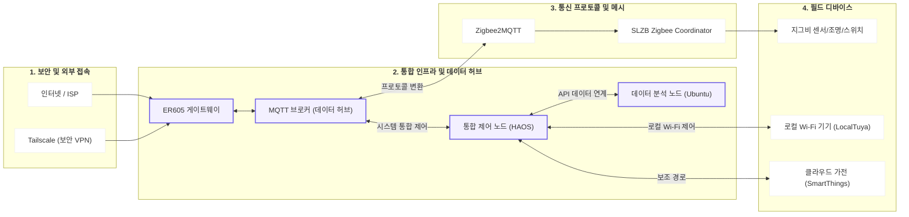
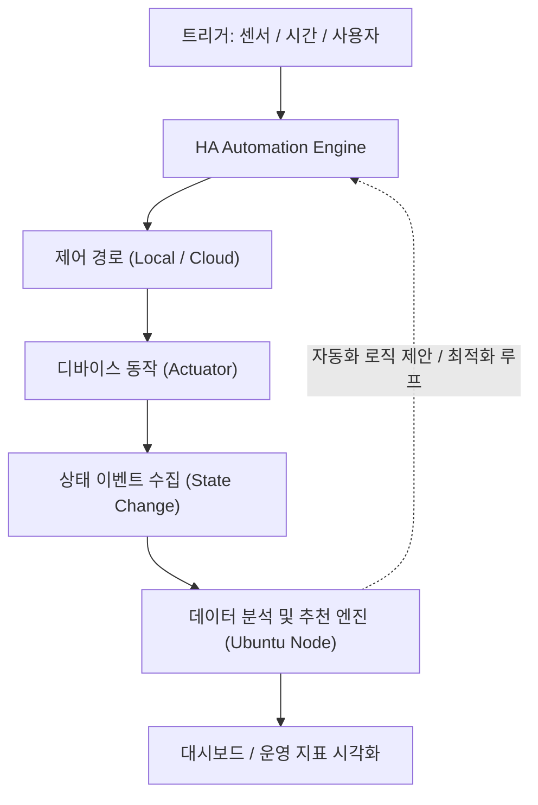

# 네트워크 토폴로지 (공개용)

## 1) L1 설계도

## 2) 제어 및 데이터 흐름 (System Workflow)

## 3) 운영 및 설계 포인트

- **서버 안정성 확보**: 가상화(Hyper-V)를 통해 제어용(HAOS)과 분석용(Ubuntu) 서버를 분리해서, 한쪽이 느려져도 집안 제어는 끊기지 않도록 구성
- **네트워크 단순화**: 단일 내부망 환경에서 400개 이상의 기기들을 중복 없이 식별하고 관리
- **고정 주소 운영**: 모든 기기에 고정 IP를 부여해서 공유기 재부팅이나 기기 교체 시에도 자동화가 깨지지 않게 유지
- **통신 간섭 최소화**: 와이파이와 지그비 간의 전파 간섭을 줄이기 위해 최적의 채널을 직접 지정해서 운영

## 4) 장애 대응 및 복구

- **상시 모니터링**: 응답 지연이나 기기 오프라인 상태를 로그를 통해 실시간으로 탐지
- **원인 분류**: 통신 문제, 전원 문제, 혹은 자동화 로직의 충돌인지 원인을 명확히 파악
- **복구 조치**: 신호 간섭 시 채널 조정, 기기 재조인 후 깨진 이름 복구 등 상황에 맞는 조치 수행
- **검증**: 자동화 실행 기록을 다시 확인해서 문제가 해결되었는지 최종 검토

## 5) 시스템 제원

| 항목 | 상세 사양 | 비고 |
| :--- | :--- | :--- |
| **서버 하드웨어** | Intel N100 저전력 Mini PC | 24/7 상시 운영 |
| **가상화 기술** | Windows 11 Pro + Hyper-V | 서버 자원 격리 |
| **노드 분리** | 제어용 HAOS / 분석용 Ubuntu | 운영 안정성 확보 |
| **저장소 관리** | LVM (Logical Volume Manager) | 용량 유연 확장 |
| **네트워크 관리** | TP-Link ER605 게이트웨이 | VPN 및 보안 관리 |
