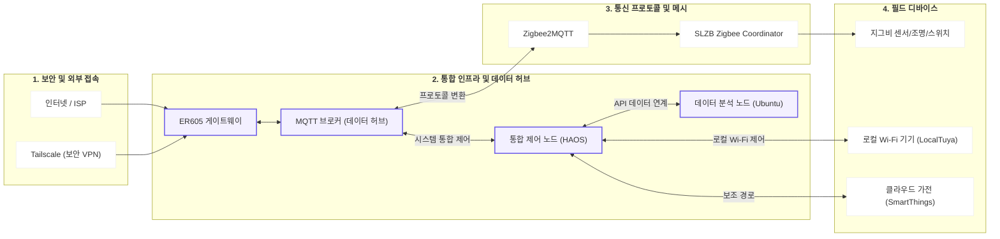
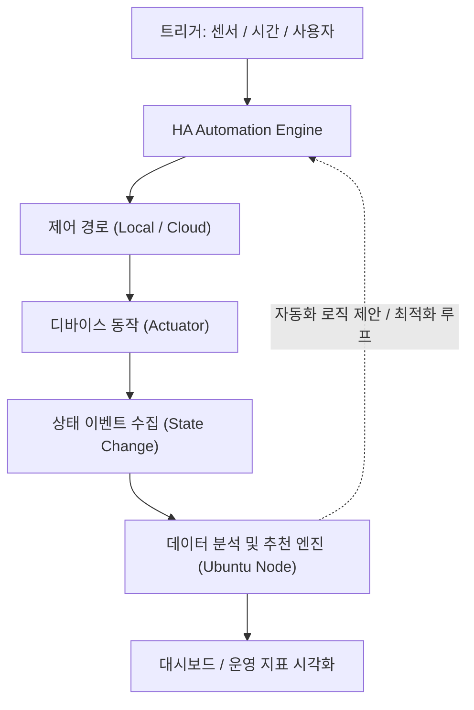

# 네트워크 토폴로지 (공개용)

## 1) L1 설계도

## 2) 제어 및 데이터 흐름 (System Workflow)

## 3) 아키텍처 설계 및 운영 전략

- **서버 자원 격리 및 가용성 확보**: Hyper-V 가상화를 통해 제어(HAOS)와 분석(Ubuntu) 노드의 리소스를 독립 배분하여 시스템 간 간섭 및 자원 경합 원천 차단
- **L2/L3 경계 단순화**: 단일 내부망 환경에서 IoT 디바이스의 체계적인 식별 및 관리 체계 구축
- **주소 관리 체계**: DHCP 예약(Reservation) 기반 운영으로 장치 교체 및 재부팅 시에도 식별 정합성 유지
- **프로토콜 역할 분리**: Zigbee(Mesh 프로토콜), MQTT(메시지 버스), Wi-Fi(IP 제어)의 계층적 역할 정의 및 최적 채널링

## 4) 장애 대응 및 복구 경로

- **증상 탐지**: timeout / offline / route failure 등 상태 기반 실시간 모니터링
- **원인 분류**: 통신 문제(Physical/RF) / 전원 문제 / 통합 참조(Logic) 문제로 체계적 분류
- **복구 조치**: 채널 최적화, 기기 재조인, 캐노니컬 엔티티 참조 복구 프로세스 가동
- **검증 절차**: 자동화 트레이스(Trace) 분석 및 실행 로그 확인을 통한 복구 완료 검증

## 5) 시스템 제원 (System Specs)

| 항목 | 상세 사양 | 비고 |
| :--- | :--- | :--- |
| **Main Server** | Intel N100 저전력 Mini PC | 24/7 상시 운영 인프라 |
| **Virtualization** | Windows 11 Pro + Hyper-V | VM 기반 하드웨어 자원 격리 |
| **Node Isolation** | VM 1: HAOS (제어) / VM 2: Ubuntu (분석) | 인프라 운영 안정성 확보 |
| **Storage Management** | LVM (Logical Volume Manager) | 데이터 노드 파티션 유연 확장 |
| **Network Gateway** | TP-Link ER605 | VPN 터널링 및 내부망 보안 관리 |
