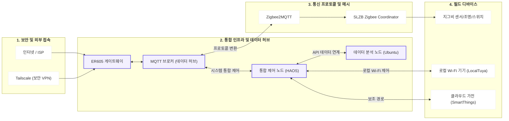
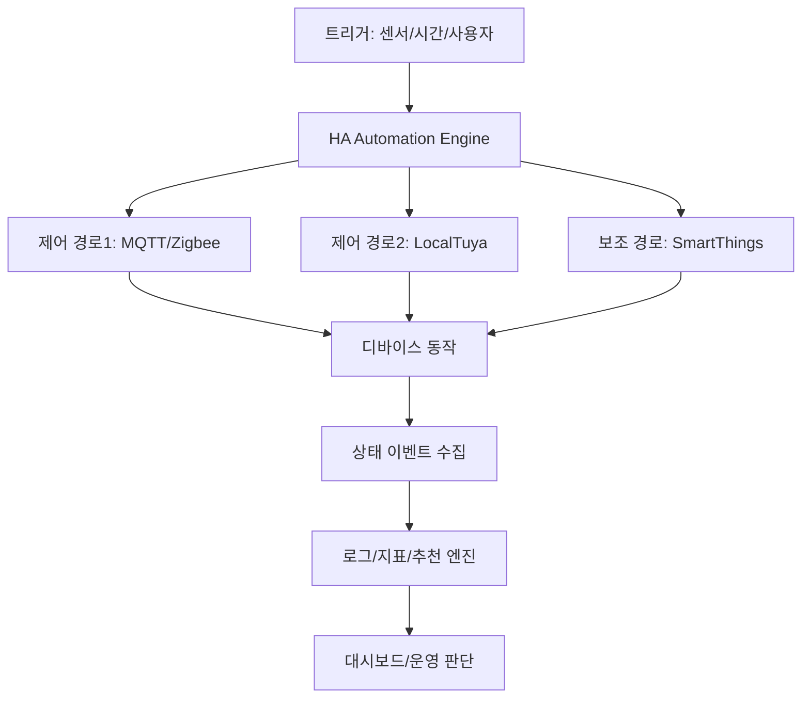

# 네트워크 토폴로지 (공개용)

## 1) L1 설계도

## 2) 데이터 흐름

## 3) 네트워크 엔지니어 관점 포인트

- L2/L3 경계 단순화: 단일 내부망에서 IoT 디바이스 식별/관리
- 주소 관리: DHCP 예약 기반 운영으로 장치 식별 안정화
- 프로토콜 분리: Zigbee(Mesh), MQTT(메시지 버스), Wi-Fi(디바이스 제어) 역할 분리
- 운영 경로 분리: 로컬 우선 + 클라우드 보조

## 4) 장애 대응 경로

- 증상 탐지: timeout/offline/route failure
- 분류: 통신 문제 / 전원 문제 / 통합 참조 문제
- 조치: 채널 조정, 재조인, 엔티티 참조 복구
- 검증: 자동화 트레이스/상태 변경/실행 로그 확인
